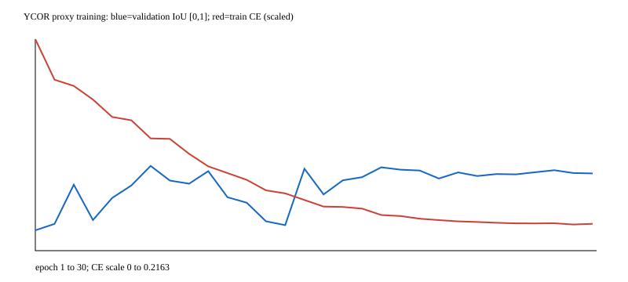

# YCOR 可通行草地代理模型：真实训练与 B0 对比

2026-09-21。**已完成代理任务训练，真实可割适配尚未完成。** 本轮实际训练 MobileNetV3-Large + LR-ASPP 二分类模型；30 epoch、2,370 次优化器更新，最佳权重按内部验证集选在 epoch 7。冻结后在全部 145 张官方 valid 上评测。没有微调 B0，没有启动 PP-LiteSeg，没有继续优化 ResNet18。

LR-ASPP 的 IoU 和漏检优于现成 B0，假阳性和预测正类错误比例更差；边界仍较差。完整已解码图像推理 P50 为 7.626 ms，B0 为 11.287 ms（本机约 1.48 倍吞吐倒数优势、延迟减少 32.43%）。这支持继续改善数据和训练，不能证明安全可割，也不支持板端速度推断。

## 数据、许可和冻结划分

[YCOR 官网](https://theairlab.org/yamaha-offroad-dataset/)明确将数据集置于 [CC BY 4.0](https://creativecommons.org/licenses/by/4.0/)；采用该公开许可作为本次研究训练依据，未添加作者额外书面授权前提。下载由官网链接的 [Box 包](https://cmu.box.com/s/3fngoljhcwhqf2z5cbepufh331qtesxt)。实际包 155,266,239 bytes，SHA-256 `2a18c82e05aee66bb49480d3a74fcc73ba0129418b7b26a4a7d4a57e67c5cbe2`。检查全部 3,233 个归档条目：附带材料仅 train/index.html、valid/index.html，无独立 LICENSE、README 或时间/地点映射，没有发现与官网冲突的条款；附带文件摘要见 split.json。这不等于包内另附了一份许可。

引用：Daniel Maturana, Po-Wei Chou, Masashi Uenoyama, Sebastian Scherer (2018), *Real-time semantic mapping for autonomous off-road navigation*, Field and Service Robotics, pp.335–350。[作者论文](https://www.ri.cmu.edu/wp-content/uploads/2017/11/semantic-mapping-offroad-nav-compressed.pdf)。本项目将语义标签转换为代理二分类、调整尺寸并训练新模型。公开结果保留来源与修改说明，不发布原图或权重。

原图/标注 1024×544；实际索引 PNG 的 0（白色）为未标注 → 255 ignore，2 traversable grass → 1，1/3/4/5/6/7/8 → 0，分别是 smooth trail、rough trail、puddle、obstacle、non-traversable low vegetation、high vegetation、sky。检查九种调色板值，结合官方论文的八个有效语义类及白色未标注区域核对；官网简要类别列表未列 puddle，完整标签包含它。**其他 vegetation 不合并到正类。** 图像/标注尺寸、编码、叠加图和四张过拟合样本已实际检查。

官方 train 931 / valid 145。官网/论文声明两者采集会话不重叠、地点有重叠，但下载包没有时间戳或地点映射，无法逐帧独立验证其声明。内部训练的 IID 顺序不是可靠时间顺序，因此不随机拆相邻帧；根据约 60 张抽查图中的车辆/场景来源，把官方 train 中 iid≥1053 的完整红车来源组作为调参验证，其余早期来源组用于训练。该分组是人工推断，不能证明同一地点或会话绝不跨组；用户已接受这一保守探索性划分。

冻结结果：训练 628、调参验证 293、最终留出 145。官方 valid 原封保留，训练和 checkpoint 选择不访问其预测/指标。模型选择前仅用于数据完整性及跨集合图像相似性核查。跨集合检查编码/解码 SHA-256 完全重复，以及 64-bit dHash 距离≤6 且 RGB 32×16 RMSE≤18 的明显近重复；无完全重复，11 个近重复候选对应 10 张训练图被排除，优先保留 test、其次 val。规则、全部候选、排除 ID、原图和 mask 摘要在 [split.json](split.json)，SHA-256 `4b76b3c1c60baeee012983a9eca13c78e5b484573e524bd042258029179e67d4`，seed 20260921。该启发式不能排除视角/光照变化的近重复，也不能证明采集序列独立。

因此称为 **地点可能重叠的探索性留出评测**。没有已知庭院 ID，不冒充每庭院独立评估；下面的五组只是官方 valid 每 50 个 IID 的诊断分箱，不是五个已核实独立地点。有效样本量是相关图像/来源组，不能把约 2,700 万有效像素当作独立样本。GrassSegHB 许可仍未确认，本轮没有用它做新训练或新评测，历史 REPORT.md 未改。

## 模型与实际训练

使用 [torchvision 官方 LR-ASPP](https://docs.pytorch.org/vision/stable/models/generated/torchvision.models.segmentation.lraspp_mobilenet_v3_large.html)，膨胀 MobileNetV3-Large、低/高层 stride 8/16、128 通道中间层、两路分类器融合，3,218,308 参数。代码 BSD-3-Clause；[官方预训练说明](https://github.com/pytorch/vision#pre-trained-model-license)不把代码许可等同于训练数据/权重的全部使用权。

预训练仅是 **ImageNet-1K V1 分类骨干**：[官方下载](https://download.pytorch.org/models/mobilenet_v3_large-8738ca79.pth)，SHA-256 `8738ca797c879b547d18bbd15da5736ff2557b2036a9af72225393ca61759a04`。weights=None，weights_backbone=IMAGENET1K_V1，整个二分类 LR-ASPP 头随机初始化，然后所有参数实际接受监督训练；没有采用完整 COCO/VOC 分割权重。分类权重的中心裁剪配方不用于本任务，使用下面的同步整图变换。

四张训练样本先做无增强过拟合检查，batch=4、AdamW lr=.003、上限 300 次更新；实际 120 次、14.59 秒达到同四样本 eval IoU 93.93%、CE 0.04334，通过链路检查，不能作为泛化分数。[overfit.json](overfit.json)保留逐次日志。随后从相同 ImageNet 骨干重新初始化正式训练，没有沿用过拟合模型。

正式配置：整图输入宽512×高384，RGB PIL 双线性、标签最近邻；同步水平翻转 p=.5，图像亮度乘数 U(.8,1.2)，无裁剪。RGB/255，mean=[.485,.456,.406]、std=[.229,.224,.225]。AdamW lr=.001、weight_decay=.0001，余弦退火 30 epoch 到 .00001，无加权 CrossEntropy、ignore_index=255，batch=8，FP32、TF32 关闭、4 CPU 线程，seed=20260921。预算 30 epoch、最长 45 分钟；实际全部完成，训练+验证循环 513.57 秒（8.56 分钟，不含数据预载、模型初始化/下载）。未做超参数搜索、阈值调优或测试反馈重训。

只按内部验证 aggregate 正类 IoU 选 best：epoch 7、40.0616%。训练/验证曲线波动较大、后期没有持续提升，说明来源变化与过拟合仍需改善；最终留出 IoU 高于内部验证不能解释为普遍泛化保证。argmax 固定，不选阈值。最佳 checkpoint 内记录 553 次更新，完整训练总计 2,370 次更新；两者不矛盾。

环境：WSL2 Ubuntu-22.04 / Linux 6.6.87.2、i9-14900HX、RTX 5060 Laptop GPU 8151 MiB、驱动592.27、Python3.10.12、Torch2.14.0+cu130、torchvision0.29.0+cu130、CUDA13.0、transformers5.17.0、numpy2.2.6、Pillow12.3.0。复用现有虚拟环境，未破坏依赖、未用付费云。固定随机种子、CUBLAS_WORKSPACE_CONFIG=:4096:8，确定性算法 warn_only；实际 CUDA CE 提示没有确定性实现，因此可复现流程/加载，不保证重训逐位相同。

[config.json](config.json)、[history.json](history.json)、[training.log](training.log)、[completed.json](completed.json)、[run-provenance.json](run-provenance.json)记录实际配置、曲线和执行代码摘要。provenance 中 pretrained.head 的“untrained”描述的是初始化来源，最终 best.pt 已训练；test_evaluated=false 是训练结束时状态，随后独立冻结评测见 frozen/results。最终代码修正过拟合配置记录中误带入的正式训练默认值，并让新图 CLI 显式关闭 TF32 以与评测精度一致；原执行训练脚本保存于 runs 下，数值、权重及训练轨迹未更改。



## 同一 512×384 输出配置的效果

两模型都输出原始 0/1 CPU 掩码，宽512×高384，用于粗分割代理比较；不恢复到原图、不声称满足导航或割草空间精度。LR 输入512×384，B0按原 checkpoint ImageProcessor 输入512×512，整图缩放无裁切，两者输出覆盖相同完整视野；GT 同步最近邻到512×384。模型 logits 先双线性插值到目标尺寸（align_corners=False），再 argmax；B0 的150类 argmax 等于 ADE20K grass/id9 才为正类，未做草坪微调。B0 3,752,694 参数，固定 [NVIDIA checkpoint](https://huggingface.co/nvidia/segformer-b0-finetuned-ade-512-512/tree/489d5cd81a0b59fab9b7ea758d3548ebe99677da)，revision 489d5cd81a0b59fab9b7ea758d3548ebe99677da；其非商业研究/评估许可限制仍适用。这是**领域训练轻量方案与现成 B0 方案比较**，训练数据/配方不同，不是纯架构优劣实验。

IoU=TP/(TP+FP+FN)，假阳性率=FP/(FP+TN)，漏检率=FN/(TP+FN)，预测正类错误比例=FP/(TP+FP)。ignore 不计混淆矩阵，零分母记 null/N/A。边界为二分类四邻域变化的两侧像素，不计算画面周边；在512×384用 Chebyshev 半径2像素匹配，双方都排除距任何 ignore ≤3像素的边界，避免未标注区域产生伪边界。precision=匹配预测边界/预测边界，recall=匹配真值边界/真值边界，F1 为调和均值。

| 指标 | LR-ASPP | B0 |
|---|---:|---:|
| 正类 IoU ↑ | 65.03% | 53.86% |
| 草地假阳性率 ↓ | 5.83% | 2.93% |
| 草地漏检率 ↓ | 15.67% | 38.12% |
| 预测正类错误比例 ↓ | 26.03% | 19.39% |
| 边界 precision ↑ | 22.15% | 20.51% |
| 边界 recall ↑ | 28.81% | 12.56% |
| 边界 F1 ↑ | 25.05% | 15.58% |

| 模型 | TP | FP | TN | FN | ignore |
|---|---:|---:|---:|---:|---:|
| lraspp | 3741080 | 1316434 | 21249616 | 694928 | 1506102 |
| b0 | 2745047 | 660444 | 21905606 | 1690961 | 1506102 |

整体为累加像素混淆计数后计算。完整逐图、逐组混淆和边界计数见 [results.json](results.json)，覆盖 145/145，两模型使用同一清单/标签规则。没有把历史高分辨率准确率拼到新速度结果中，也没有额外原图分辨率结果。

| 诊断组 / 张数 | 模型 | IoU | 假阳性率 | 漏检率 | 预测正类错误比例 | 边界 F1 |
|---|---|---:|---:|---:|---:|---:|
| official-valid-iid-0 / 29 | lraspp | 65.50% | 11.13% | 5.72% | 31.78% | 27.72% |
| official-valid-iid-0 / 29 | b0 | 65.51% | 2.23% | 28.73% | 10.98% | 16.82% |
| official-valid-iid-1 / 24 | lraspp | 76.65% | 4.78% | 11.83% | 14.57% | 27.50% |
| official-valid-iid-1 / 24 | b0 | 60.82% | 11.37% | 17.42% | 30.22% | 19.74% |
| official-valid-iid-2 / 47 | lraspp | 58.03% | 5.13% | 16.83% | 34.24% | 25.86% |
| official-valid-iid-2 / 47 | b0 | 34.33% | 0.50% | 64.21% | 10.62% | 9.15% |
| official-valid-iid-3 / 32 | lraspp | 61.78% | 4.61% | 25.09% | 22.10% | 19.32% |
| official-valid-iid-3 / 32 | b0 | 49.22% | 2.34% | 45.46% | 16.55% | 15.40% |
| official-valid-iid-4 / 13 | lraspp | 59.89% | 2.33% | 29.95% | 19.50% | 23.47% |
| official-valid-iid-4 / 13 | b0 | 56.24% | 1.10% | 39.26% | 11.66% | 21.07% |

## 失败案例与风险

| 样本 | 模型 | IoU | 假阳性率 | 漏检率 |
|---|---|---:|---:|---:|
| iid000879 | lraspp | 0.00% | 30.89% | N/A |
| iid000879 | b0 | 0.00% | 0.19% | N/A |
| iid000919 | lraspp | 84.33% | 0.28% | 15.06% |
| iid000919 | b0 | 50.12% | 38.59% | 0.00% |
| iid000982 | lraspp | 0.00% | 0.00% | 100.00% |
| iid000982 | b0 | 0.00% | 0.00% | 100.00% |
| iid001039 | lraspp | 0.09% | 0.00% | 99.91% |
| iid001039 | b0 | 0.00% | 0.00% | 100.00% |

已实际查看 iid000879：土路两旁茂密草丛，GT 没有 traversable grass，LR 将大片路边植被判正（假阳性30.89%），B0 更保守；这是“看起来像草”与“可通行草地”混淆。iid000919：暗光草地与前景碎石，B0 把大片碎石区域判正（假阳性38.59%），LR 贴近草地但边缘及内部有漏检。iid000982、iid001039 的数值显示 LR 也存在接近完全漏检，不能被整体平均掩盖。第一诊断组 LR 假阳性11.13%，末组漏检29.95%；模型尚不稳健。

失败合成图保存在本机 outputs/ycor-final-20260921/*-failure.jpg，不提交含原图产物；准确路径与 SHA-256 见 [artifacts.json](artifacts.json)。选择规则是各模型假阳性率、漏检率最高和 IoU 最低各三张的并集，零分母排除；面板上排 RGB/GT/LR预测，下排 LR错误/B0预测/B0错误，红=FP、蓝=FN、灰=ignore。只在冻结评测后生成和分析，没有反馈到本轮 checkpoint 或划分。

## 真实离线速度

| 阶段 | LR-ASPP P50 / P95 (ms) | B0 P50 / P95 (ms) |
|---|---:|---:|
| 预处理 + H2D | 3.396 / 3.972 | 2.371 / 3.092 |
| 模型前向 | 3.733 / 4.912 | 7.477 / 8.780 |
| 后处理 + D2H | 0.338 / 0.576 | 1.337 / 1.578 |
| 完整已解码图像推理流水线 | 7.626 / 8.968 | 11.287 / 12.890 |

两模型 batch=1、FP32、TF32关闭、4线程，同一GPU，同时驻留；12 张真实最终留出图，每模型预热30次，再每图重复10次，共120次/模型，逐图逐轮交替模型顺序。各阶段边界 CUDA synchronize，完整流水线是同次实际起止 wall time，包含同步等待、H2D 和 D2H。P50/P95 各自按原始记录求分位数，阶段分位数不应直接相加。

输入合同为已解码 RGB PIL：磁盘读取、JPEG 解码、模型加载/下载在计时前完成，**解码不计入上述任何阶段**。预处理包含 CPU resize/normalize/tensor 及 H2D；前向含模型全部 forward（包括 LR-ASPP 内置输出插值）；后处理含目标 logits 插值、argmax、二分类映射、uint8 与 D2H。完整计时覆盖该已解码图像合同的必需工作，不包括 HTTP、可视化、保存或指标。若实际应用接收压缩文件，还需额外加读取/解码，不能用本表冒充文件到文件端到端速度。新图 CLI 的一次冷推理有初始化开销，不混入热态基准。

笔记本温度/功耗未锁定，交替顺序只能降低偏差；只代表这台机器，未做量化、导出或板端推断。效果与测速使用同一 Predictor、同一512×384输出，配置及240条原始时间均在 results.json。

## 加载、训练、评测与 artifact 恢复

本轮采用最小离线入口 `python -m mowerseg.ycor`，复用仓库评测边界函数和 B0 缓存加载器，未把二分类模型塞进现有细分类产品标签。输出打印及 PNG 元数据明确“YCOR 可通行草地代理模型”：0=其他有效语义类别，1=可通行草地代理；0不是 ignore、安全通行或已识别障碍物/人/动物/水体。评测始终保留原始0/1。无需网页可加载、预测与比较。

在 WSL worktree 根目录执行；输出目录必须是新路径，拒绝覆盖本次完整产物：

```bash
cd /home/watermango/github/mower-perception-lraspp
PY=/home/watermango/github/mower-perception/.venv/bin/python
# 已保存的最佳模型加载与新图推理；无需 ImageNet 权重或数据集
$PY -m mowerseg.ycor --checkpoint runs/ycor-lraspp-20260921/best.pt   --image assets/samples/lawn_path.jpg --output outputs/ycor-predict-repeat.png
# 数据已存在时使用 Git 中冻结清单；勿重分割
CUBLAS_WORKSPACE_CONFIG=:4096:8 $PY -m tools.train_ycor --overfit --output runs/ycor-overfit-repeat
CUBLAS_WORKSPACE_CONFIG=:4096:8 $PY -m tools.train_ycor --epochs 30 --batch-size 8 --output runs/ycor-train-repeat
$PY -m tools.compare_ycor --checkpoint runs/ycor-lraspp-20260921/best.pt --output outputs/ycor-comparison-repeat
HF_HUB_OFFLINE=1 $PY -m pytest tests -q
```

重训时以新目录中的 best.pt 替换比较参数；不能把重训模型分数写回本次报告。联网首次运行会从上述官方来源取 ImageNet 骨干/B0；缓存完整后可设 HF_HUB_OFFLINE=1。新环境使用报告所列版本（Blackwell 需要兼容 CUDA 的 Torch 构建），依赖沿用仓库，不安装旧研究工程 requirements。

同机合并后仍可通过绝对路径读取 `/home/watermango/github/mower-perception-lraspp/runs/ycor-lraspp-20260921/best.pt`，SHA-256 **3fa39de55d0c1dd2a7debce5038703201740e3daa26e9e3f4b6a2f1dacede901**。它自带架构所需 state_dict、标签、epoch、更新数、配置和验证指标，严格加载，无需训练数据。数据在同 worktree `data/ycor/yamaha_v0`，归档 `data/ycor/official-package.tar.gz`；日志/配置/曲线在 `runs/ycor-lraspp-20260921`，原始二值预测/失败图在 `outputs/ycor-final-20260921`。这些目录受 Git ignore 保护。

**没有公开下载训练权重**：本机 worktree/artifact 不是远程持久化仓库；删除前应由用户备份。其他机器需由用户授权复制 best.pt 并核验上面摘要，或按命令重新训练（不保证同一SHA）。原始数据可按官网公共链接重新获取并校验归档 SHA，随后执行：

```bash
# 下载到 data/ycor/official-package.tar.gz 后；输出必须新建，保留原冻结清单
$PY -m tools.prepare_ycor --archive data/ycor/official-package.tar.gz   --root data/ycor/yamaha_v0 --output outputs/ycor-split-rebuilt.json
sha256sum outputs/ycor-split-rebuilt.json evaluation/ycor/split.json
```

下载链接在 split.json 的 download 字段；工具检查固定归档 SHA、安全解包、palette、图像对齐和跨组摘要，不允许任意新包悄悄替换。既有模型仍使用 Git 冻结清单，本机实际重新执行该命令，得到完全相同摘要。原图/权重不进入 Git，也未上传第三方发布服务。

## 验证与下一步

44 项 Python 测试通过，包括 ignore/伪边界、公式、分组与重复泄漏、checkpoint 元数据拒绝、同步增强及计时传输边界；实际 best.pt 严格重新加载后重现已保存测试掩码。新图片 lawn_path.jpg 命令推理成功，PNG 为512×384且仅0/1，保留代理标识；全部290张预测摘要/标签/尺寸及混淆计数覆盖经二次校验。[verification.json](verification.json)保存证据。前端没有代码变化，但现有 ESLint、Next typegen、tsc、默认生产构建均已通过。

优先改善带真实来源元数据的训练/验证覆盖、不可通行草丛和暗光/边界样本，再验证真实可割标签；本轮不因测试负面结果调参或换划分。当前代理的速度值得保留，但假阳性和极端漏检尚不支持优先投入量化/板端工作。GrassSegHB 授权和真实可割任务仍待解决。PR #5 保持草稿、未合并，交由项目审核 agent 决定，不创建自动审核任务。
